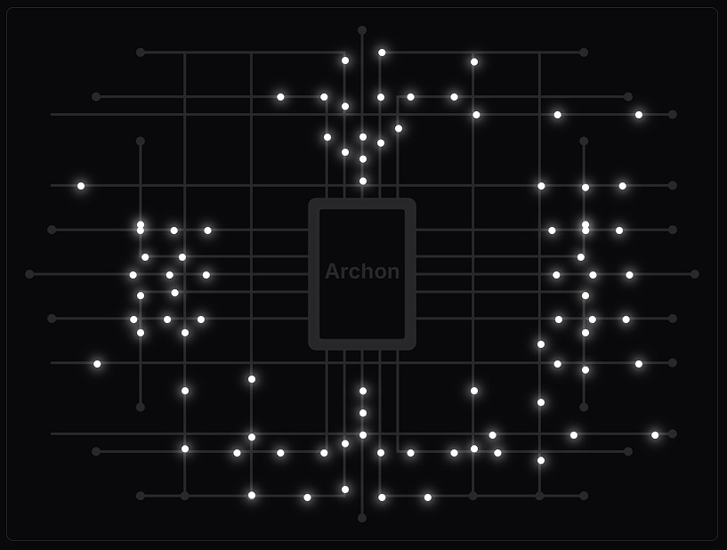

<p align="center">
  
</p>

# 🏛️ Archon AI: Governe seu Workflow de IA

**Archon AI** é um framework para orquestrar o desenvolvimento de software com IA de forma **confiável, rastreável e supervisionada**. Ele transforma a IA de um "copiloto imprevisível" em uma ferramenta de engenharia de software que segue um plano, respeita o contexto e permite a intervenção humana em pontos de controle.

O objetivo é simples: **deixar de ser um programador refém da IA e se tornar o arquiteto que comanda o ciclo de desenvolvimento.**

---

## 🚫 O Problema: O "Vibe Code"

Agentes de IA e assistentes de código autônomos, embora poderosos, frequentemente sofrem com:
- **Alucinações:** Inventam código ou funcionalidades.
- **Perda de Contexto:** Esquecem decisões importantes tomadas anteriormente.
- **Modificações Inesperadas:** Alteram arquivos sem um plano claro.
- **Falta de Rastreabilidade:** É impossível auditar *por que* uma decisão foi tomada.

Este framework foi criado para resolver esses problemas.

## ✅ A Solução: Uma Arquitetura Supervisionada e Orquestrada

O Archon AI atua como o **orquestrador principal**, preparando o terreno e gerando artefatos acionáveis para que **outros agentes de IA (como o Gemini CLI)** possam dar continuidade ao trabalho de forma autônoma e contextualizada. Isso é alcançado através de uma arquitetura de camadas:

1.  **🎓 Base de Conhecimento Contextual:** Utilizamos arquivos `.md` para definir o domínio, a arquitetura e as regras do projeto. Esta base de conhecimento serve como o "cérebro" contextual para a IA, garantindo que as decisões sejam tomadas com base em informações consistentes.
2.  **🛠️ Orquestrador FSM (Finite State Machine):** Uma Máquina de Estados Finitos garante que o projeto seja executado em uma sequência lógica (`planejamento → arquitetura → backend...`). O fluxo **pausa para validação humana** a cada etapa, evitando erros em cascata e permitindo a intervenção do supervisor.
3.  **📋 Engenharia de Prompt Avançada:** Prompts são gerados dinamicamente, utilizando a base de conhecimento para fornecer instruções precisas e contextualizadas à IA, em vez de comandos genéricos.
4.  **🧩 Geração de Roteiros para Agentes (`Gemini.md`):** Após cada etapa, o Archon gera um arquivo `Gemini.md` na pasta do projeto. Este arquivo atua como um **roteiro de execução** claro e estruturado para outros agentes de IA (como o Gemini CLI), contendo instruções sobre qual artefato analisar e quais ações tomar (criar arquivos, executar comandos, etc.).
5.  **📊 Memória Persistente e Rastreabilidade:** Um diário de execução (`diario_execucao.json`) registra cada passo, decisão e resultado. Isso garante **rastreabilidade, auditoria e a capacidade de retomar o trabalho** de onde parou, além de fornecer um histórico valioso para o aprendizado contínuo.

---

Este repositório contém o "Starter Kit" completo, com um backend em Python (Flask) e um frontend interativo para você começar a construir seus próprios projetos com IA de forma governada.

## Arquitetura e Stack Tecnológica

O projeto é construído sobre uma stack Python robusta:

-   **Linguagem:** Python
-   **Framework Web:** Flask
-   **Orquestração:** O `fsm_orquestrador.py` gerencia o fluxo do projeto como uma Máquina de Estados Finitos (FSM).
-   **Agente CLI:** O `agente/executor_agente.py` atua como um agente de linha de comando, lendo o `Gemini.md` e executando as ações necessárias.
-   **Interface:** O painel de controle (`dashboard.html`) é construído com HTML, TailwindCSS e Vanilla JavaScript (`main.js`), comunicando-se com o backend via API REST.


## Documentação Completa

Para um mergulho profundo no projeto, acesse a documentação detalhada:

-   **`01-visao-geral.md`**: Entenda o problema que o Archon resolve e a nossa arquitetura de orquestração de agentes.
-   **`02-instalacao.md`**: Passo a passo para configurar e rodar o projeto em seu ambiente local.
-   **`03-arquitetura.md`**: Uma análise aprofundada dos principais arquivos (`app.py`, `fsm_orquestrador.py`, `executor_agente.py`, etc.) e como eles se conectam.
-   **`04-workflow.md`**: Aprenda a editar o `workflow.json` para criar seus próprios fluxos de trabalho e como ele influencia a geração do `Gemini.md`.
-   **`05-contribuindo.md`**: Diretrizes para quem deseja contribuir com o projeto.
-   **`06-api-endpoints.md`**: Documentação completa dos endpoints da API REST.
-   **`07-deploy.md`**: Guia para deploy em produção (Render e Vercel) e configuração do Stripe.

---

## 📚 Documentação Detalhada

Acesse a documentação completa do projeto para detalhes, exemplos e guias práticos:

- [Visão Geral](docs/01-visao-geral.md)
- [Instalação](docs/02-instalacao.md)
- [Arquitetura](docs/03-arquitetura.md)
- [Workflow](docs/04-workflow.md)
- [Contribuindo](docs/05-contribuindo.md)

---

## ⚙️ Instalação e Configuração

### Pré-requisitos
- Python 3.9 ou superior

### 1. Configuração do Ambiente Python

1.  **Crie e ative um ambiente virtual:**
    ```bash
    # Crie o ambiente
    python -m venv venv
    
    # Ative no Windows
    .\venv\Scripts\activate
    
    # Ative no macOS/Linux
    source venv/bin/activate
    ```

2.  **Instale as dependências:**
    ```bash
    pip install -r requirements.txt
    ```

### 2. Variáveis de Ambiente

1.  **Crie o arquivo `.env`:** Se ele não existir, renomeie o arquivo `.env.example` para `.env`.
2.  **Adicione suas chaves:** Preencha o arquivo `.env` com suas chaves de API (GEMINI_API_KEY, STRIPE_SECRET_KEY, etc.).

### 3. Executando o Projeto

Com tudo configurado, você pode iniciar a aplicação de duas formas:

#### 1. Iniciando o Servidor Web (Painel de Controle)

Para acessar a interface visual do Archon AI:

```bash
flask run
```

*Acesse o painel em seu navegador (geralmente `http://127.0.0.1:5000`).*

#### 2. Executando o Agente CLI (Linha de Comando)

Para usar o agente diretamente via linha de comando, por exemplo, para que ele execute um projeto gerado pelo Archon:

```bash
python main.py --project_path "./projetos/NomeDoSeuProjeto"
```

*Substitua `./projetos/NomeDoSeuProjeto` pelo caminho real da pasta do projeto que você deseja que o agente processe. O agente buscará o `Gemini.md` dentro dessa pasta para iniciar sua missão.*

---


## 🚀 Venda e Entrega Automatizada com Stripe


Além de ser um framework de desenvolvimento, o Archon AI vem preparado com uma **Landing Page (`landing.html`)** e um **backend de pagamentos** para que você possa vender e distribuir seu produto final.

A `landing.html` serve como sua vitrine digital, explicando o valor do seu projeto e guiando os usuários para a compra. O fluxo é totalmente automatizado:

1.  **CTA na Landing Page**: O usuário clica em um botão de compra.
2.  **Checkout Seguro**: Um popup solicita o e-mail do cliente e o redireciona para o ambiente de pagamento seguro do Stripe.
3.  **Confirmação de Pagamento**: Após o pagamento bem-sucedido, o Stripe envia uma notificação (webhook) para a rota `/webhook` da nossa aplicação.
4.  **Entrega Automatizada**: O backend verifica a notificação e dispara a ação final, como enviar um e-mail para o cliente com o link de acesso ao repositório privado do GitHub.

### Testando o Fluxo de Pagamento Localmente

Para testar todo o processo sem usar um cartão de crédito real, utilizamos a **Stripe CLI**:

1.  **Inicie o servidor Flask**:
    ```bash
    python app.py
    ```
2.  **Inicie o "ouvinte" do Stripe** em um segundo terminal. Ele irá encaminhar os eventos para o seu servidor local:
    ```bash
    stripe listen --forward-to http://127.0.0.1:5001/webhook
    ```
3.  O comando acima fornecerá uma **chave secreta de webhook** (`whsec_...`). Adicione-a ao seu arquivo `.env`.
4.  Acesse a `landing.html` no navegador, inicie a compra e use os cartões de teste do Stripe para finalizar o pagamento. Você verá os logs da confirmação no terminal do Flask.

---

## ☁️ Deploy em Produção (Render e Vercel)

Para que sua aplicação fique acessível na internet, o projeto está configurado para deploy em duas plataformas:

### Render

A **Render** é uma solução PaaS (Platform as a Service) moderna e fácil de usar. O arquivo `render.yaml` na raiz do projeto define a "infraestrutura como código", instruindo o Render a:
- Usar Python 3.11.
- Instalar as dependências do `requirements.txt`.
- Iniciar a aplicação usando **Gunicorn**, um servidor WSGI robusto para produção.
- Carregar as variáveis de ambiente (suas chaves do Stripe) de um grupo seguro.

Para fazer o deploy, basta conectar sua conta do Render ao repositório no GitHub e criar um "New Blueprint Instance". O Render cuidará do resto.

### Vercel

A **Vercel** é uma plataforma de deploy para frontends e funções serverless. O arquivo `vercel.json` na raiz do projeto configura o deploy, definindo que `app.py` será construído usando o runtime `@vercel/python` e que todas as requisições serão redirecionadas para ele.

Para fazer o deploy, basta conectar sua conta da Vercel ao repositório no GitHub e importar o projeto. A Vercel detectará automaticamente a configuração.

---


